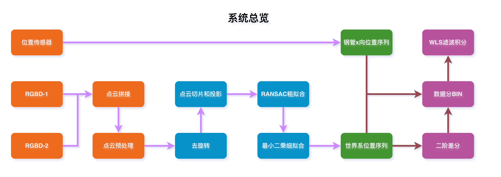
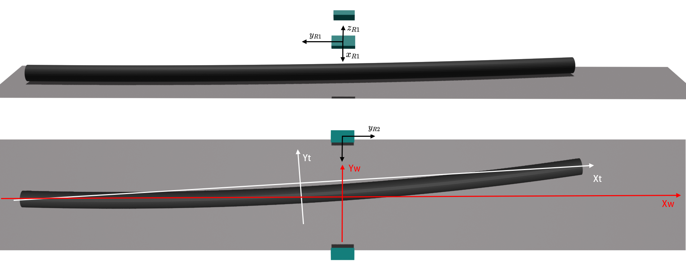
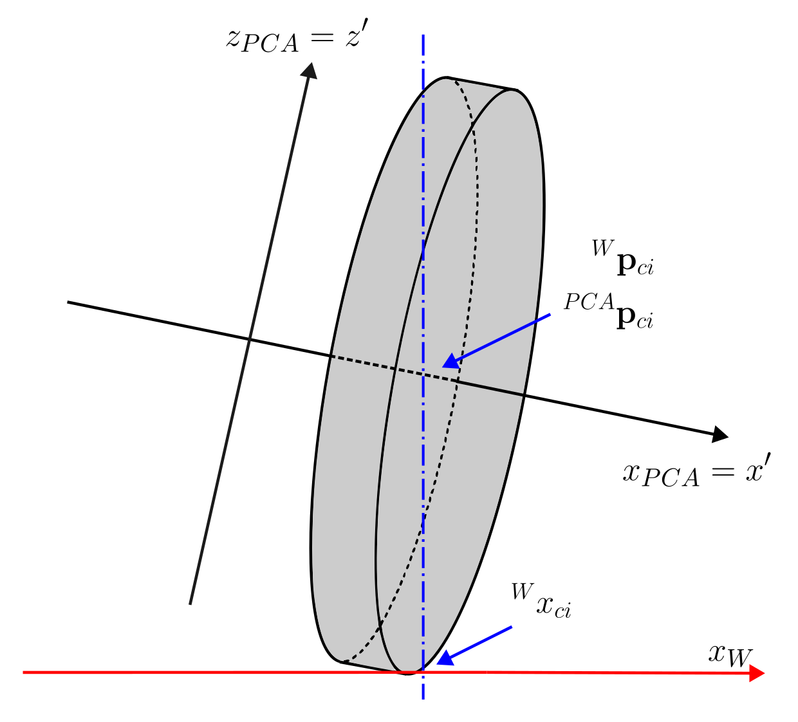

# 大直径钢管直度测量系统算法设计

## 一、介绍

## 二、 方法

### 1. 总览

系统总览如图，我们可以看到，整个系统的传感器部分为两个RGBD相机输出的点云数据（包括其相对于世界坐标的变换），及传送带的位置传感器，用于检测钢管在传送带上的位置。一般情况下，我们只能知道钢管在传送系统（即世界坐标系）的轴线（x轴）的位置信息，此处我们仅需要该信息。整个系统的软件部分分在线处理和离线处理两部分。接收到的点云通过拼接和预处理，输出仅保留钢管区域的相机可视有效点云数据，然后，对这段点云进行去旋转操作，以避免切片投影后的椭圆形2D点云对圆形拟合产生的影响，并随后进行三段点云切片。在圆形拟合部分，我们采用RANSAC粗拟合加最小二乘细拟合方案，以确保在两传感器无法完全覆盖钢管的前提下的圆形拟合精度。紧接着，我们根据位置传感器信息将得到三段点云切片转换到世界坐标系中，得到圆形的绝对位置，并同时计算圆心处钢管的二阶差分数据（曲率）。在全部钢管扫描完成后，我们可以分bin将数据存入数据存储器，将所有点变换到钢管坐标系上，并使用Weighted Least Squares（WLS）法估计出最优钢管圆心轨迹，从而得到直度。

### 2. 坐标系定义

为了便于描述和计算，我们定义坐标系如下图：

其中各坐标系解释如下

* RGBD相机坐标系（R1、R2）：x为相机光轴方向，y轴为相平面长边方向。
* 世界坐标系（W）：x为传送带正向，z为正向上。
* 钢管坐标系（T）：x轴为钢管两侧圆心连线，与W系x轴正向呈锐角，z轴为正向上。

对于以上坐标系，RGBD与世界坐标系的变换可以由手眼标定算法得到[CITE]，因而为已知量，钢管坐标系与世界坐标系的x向平移可由位置传感器得到，其余变换关系均未知。由于钢管坐标系原点与直度无关，因此可以任意选取。

### 3. 点云拼接和预处理

由于RGBD与世界坐标系的变换已知，我们可以容易计算点云中的每一点相对于世界坐标系的坐标，从而能够对两传感器的点云数据进行坐标变换和拼接。
$$
^W\mathbf{p}_i \ = \ ^W_{R_k}\mathbf{R} \ ^{R_k}\mathbf{p}_i \ + \ ^W_{R_k}\mathbf{t}
$$
由于相机视野较大，因此读入的点云包含大量支撑支架、导轨等非目标背景。由于具体应用场景往往是结构化场景，即钢管位于传送平台上且范围固定，因此可以采取DBSCAN + 可行区域约束的方法来剔除背景和离群点云，以获得质量较高的点云数据。

由于RGBD相机点云密度随深度逐渐下降，其分布不均的特性将会对圆拟合造成麻烦；其次，大量的点云会显著降低处理速度，从而使分辨率和精度在钢管相同运行速度下下降。因此采用对点云进行适当体素下采样的方式来解决以上问题。

### 4. 有效区域轴线方向估计和片段截取

经上述步骤处理，我们便可以得到质量较高，分布均匀，没有背景物体的钢管局部点云数据。考虑到实际应用中，直度多为毫米级，因而此局部点云片段可近似看作标准圆柱体。然而由于钢管在传送系统运送时，局部可能不平行于世界坐标系的x轴，因此直接将可见范围点云切分将会得到椭圆形切片；由于椭圆形切片的双圆心特性，将对导致拟合圆心和实际集合中心错位，从而降低精度。因此，可以使用PCA方法，找到当前局部点云的真实轴线方向，并以该方向切分点云。

由于RGBD相机的可见局部点云，点沿轴线方向的散布远大于横截面方向的散布，因此最大方差方向必为轴线方向。因此寻找真实轴线问题，转换为寻找一组三维正交基$\{\mathbf{e}_1, \mathbf{e}_2, \mathbf{e}_3\}$使得点云数据在这些正交基上的投影方差依次达到最大，从而提取点云分布的主方向。这等价于对局部点云进行主成分分析（PCA）

首先我们需要对点云去中心化：
$$
\mathbf{q}_i = \mathbf{p}_i - \bar{\mathbf{p}}, \quad \bar{\mathbf{p}} = \frac{1}{n} \sum_{i=1}^n \mathbf{p}_i
$$

设单位向量 \(\mathbf{u}\)，点云在 \(\mathbf{u}\) 上的投影标量为 \(\mathbf{u}^\top \mathbf{q}_i\)。投影方差为：

\[
J(\mathbf{u}) = \frac{1}{n} \sum_{i=1}^n (\mathbf{u}^\top \mathbf{q}_i)^2
= \mathbf{u}^\top \left( \frac{1}{n} \sum_{i=1}^n \mathbf{q}_i \mathbf{q}_i^\top \right) \mathbf{u}
= \mathbf{u}^\top \mathbf{C} \mathbf{u}
\]

其中 \(\mathbf{C} = \frac{1}{n} \sum_{i=1}^n \mathbf{q}_i \mathbf{q}_i^\top\) 为点云的协方差矩阵（3×3 实对称半正定矩阵）。

使点云数据在正交基上的投影方差依次达到最大，即求解约束优化问题：

\[
\max_{\mathbf{u}} \; \mathbf{u}^\top \mathbf{C} \mathbf{u} \quad \text{s.t.} \quad \mathbf{u}^\top \mathbf{u} = 1
\]

引入拉格朗日乘子 \(\lambda\)，构造拉格朗日函数：

\[
\mathcal{L}(\mathbf{u}, \lambda) = \mathbf{u}^\top \mathbf{C} \mathbf{u} - \lambda (\mathbf{u}^\top \mathbf{u} - 1)
\]

对 \(\mathbf{u}\) 求梯度并令其为零：

\[
\frac{\partial \mathcal{L}}{\partial \mathbf{u}} = 2\mathbf{C}\mathbf{u} - 2\lambda\mathbf{u} = \mathbf{0}
\;\Longrightarrow\;
\mathbf{C}\mathbf{u} = \lambda\mathbf{u}
\]

因此，\(\mathbf{u}\) 必为协方差矩阵 \(\mathbf{C}\) 的特征向量，\(\lambda\) 为对应特征值。此时投影方差为：

\[
J(\mathbf{u}) = \mathbf{u}^\top \mathbf{C} \mathbf{u} = \lambda \mathbf{u}^\top \mathbf{u} = \lambda
\]

要使方差最大，应选择最大特征值 \(\lambda_1\) 对应的特征向量。记特征值排序 \(\lambda_1 \ge \lambda_2 \ge \lambda_3 \ge 0\)，对应的单位特征向量为 \(\mathbf{e}_1, \mathbf{e}_2, \mathbf{e}_3\)。则第一主方向为 \(\mathbf{e}_1\)，从而得到所求方向。

基于此，我们可以得到当前局部坐标系（设定为PCA系）与世界坐标系中点的旋转变换关系：
$$
\mathbf{q}_i' = \ ^W_{PCA}R \ \mathbf{q}_i = [\mathbf{e}_1, \mathbf{e}_2, \mathbf{e}_3] \mathbf{q}_i
$$

以有效范围中心为中心，设定片段厚度和切片步长，以$$x'$$为轴对有效范围的钢管点云进行切片，从而得到三个点云片段（$$i = 1, 2, 3$$），和其对应$$x'$$轴上的片段中心点$$^{PCA}\mathbf{p}_{ci}$$ 的$$x'$$轴分量。下图为其中一个片段的局部坐标定义图。

### 5. 轴心坐标点确定

为计算二阶差分，我们需要分别得到三段点云片段几何中心即图中$$^W\mathbf{p}_{ci}$$ 的坐标。如果我们能够的到切割片段几何中心$$^{PCA}\mathbf{p}_{ci}$$的坐标，并基于上节的到的旋转矩阵，即可计算的到$$^W\mathbf{p}_{ci}$$ ：
$$
^W\mathbf{p}_{ci} = \ ^W_{PCA}R^\top \ ^{PCA}\mathbf{p}_{ci}
$$
由于切割步长和片段厚度已知，因此我们可以得到$$^{PCA}\mathbf{p}_{ci}$$的$$x$$分量，于是乎，我们只需要得到其$$y-z$$分量即可。于是，我们可以将全部点云的$$x'$$分量去除，问题就被简化为了一个二维圆形拟合问题。

由于本项目采用的是双传感器方案，因而无法得到完整的钢管点云数据，采用直接计算质心的方式无法给最小二乘一个较好的初始值。因此，考虑先使用RANSAC提供良好初始值并过滤离群点，再建立最小二乘问题进行拟合。

#### 5.1 模型建立

设去除$x'$分量后的点集，待拟合的圆心和半径为

$$
\mathbf{p}_i =
\begin{bmatrix}
y_i \\
z_i
\end{bmatrix}, \quad i = 1,2,\dots,N \\ \\
\mathbf{c} =
\begin{bmatrix}
y_c \\
z_c
\end{bmatrix}, \quad r > 0
$$

圆方程为：

$$
\left\| \mathbf{p}_i - \mathbf{c} \right\|_2 = r
$$

每个点到圆的残差可以定义为：

\[
e_i(\mathbf{c}, r) =
\left\| \mathbf{p}_i - \mathbf{c} \right\|_2 - r
\]

我们的目标是找到使残差尽可能小的圆心与半径：

\[
\min_{\mathbf{c}, r}
\sum_{i=1}^{N} e_i(\mathbf{c}, r)^2
\]

#### 5.2 RANSAC 粗拟合

RANSAC 的作用是从含有离群点的点集中，快速估计一个较可靠的圆初值。

每次迭代随机选择三个非共线点：

$$
\mathbf{p}_a,\ \mathbf{p}_b,\ \mathbf{p}_c
$$

三点唯一确定一个候选圆：

$$
\hat{\mathbf{c}},\ \hat{r}
$$

其中候选半径为：

$$
\hat{r} = \left\| \mathbf{p}_a - \hat{\mathbf{c}} \right\|_2
$$

对所有点计算候选模型残差，若残差小于阈值，则该点被认为是内点:

$$
\hat{e}_i =
\left| \left\| \mathbf{p}_i - \hat{\mathbf{c}} \right\|_2 - \hat{r} \right| \\ \\ \hat{e}_i < \tau
$$

每次迭代统计内点数量，选择内点数最多的候选圆作为粗拟合结果，并以此作为下一步最小二乘的初始值：

$$
(\mathbf{c}_0, r_0) =
\arg\max_{(\hat{\mathbf{c}}, \hat{r})}
\left| \mathcal{I}(\hat{\mathbf{c}}, \hat{r}) \right|
$$

#### 5.3 最小二乘问题建立

RANSAC 得到初值后，将圆心和半径作为优化变量：

$$
\mathbf{x} =
\begin{bmatrix}
y_c \\
z_c \\
r
\end{bmatrix}
$$

对所有$$M$$个点，残差可以斜纹

$$
f_i(\mathbf{x}) =
\sqrt{(y_i - y_c)^2 + (z_i - z_c)^2} - r \\ \\ 
\mathbf{f}(\mathbf{x}) =
\begin{bmatrix}
f_1(\mathbf{x}) \\
f_2(\mathbf{x}) \\
\vdots \\
f_M(\mathbf{x})
\end{bmatrix}
$$

则优化问题可写为：

$$
\min_{\mathbf{x}}
\frac{1}{2}
\left\| \mathbf{f}(\mathbf{x}) \right\|_2^2
$$

在迭代求解中，对当前估计 \(\mathbf{x}_k\) 处的残差做一阶线性化：

$$
\mathbf{f}(\mathbf{x}_k + \Delta \mathbf{x})
\approx
\mathbf{f}(\mathbf{x}_k) + \mathbf{J}_k \Delta \mathbf{x}
$$

其中 \(\mathbf{J}_k\) 是残差对优化变量的雅可比矩阵：

$$
\mathbf{J}_k =
\frac{\partial \mathbf{f}}{\partial \mathbf{x}}
\bigg|_{\mathbf{x}=\mathbf{x}_k}
$$

其中第 \(i\) 行雅可比为：

$$
\frac{\partial f_i}{\partial \mathbf{x}} =
\begin{bmatrix}
\dfrac{y_c - y_i}{\sqrt{(y_i - y_c)^2 + (z_i - z_c)^2}} &
\dfrac{z_c - z_i}{\sqrt{(y_i - y_c)^2 + (z_i - z_c)^2}} &
-1
\end{bmatrix}
$$

线性化后的增量问题与对应的正规方程为：

$$
\min_{\Delta \mathbf{x}}
\frac{1}{2}
\left\|
\mathbf{J}_k \Delta \mathbf{x} + \mathbf{f}(\mathbf{x}_k)
\right\|_2^2 \\ \\
\mathbf{J}_k^{\mathbf{T}} \mathbf{J}_k \Delta \mathbf{x}
=
-\mathbf{J}_k^{\mathbf{T}} \mathbf{f}(\mathbf{x}_k)
$$

采用ceres-solver求解上述问题，可以优化收敛后得到最终圆心：

$$
\mathbf{c}^{*} =
\begin{bmatrix}
y_c^{*} \\
z_c^{*}
\end{bmatrix}
$$

设已知$$^{PCA}\mathbf{p}_{ci}$$的$$x$$分量为$$x_c^*$$则我们可以最终得到：
$$
^W\mathbf{p}_{ci} = \ ^W_{PCA}R^\top \ \begin{bmatrix}
x_c^* \\ 
y_c^* \\
z_c^*
\end{bmatrix}
$$

### 6. 二阶差分法消除误差

对上述同一时刻拍摄的三个切片进行相同的圆拟合操作，我们可以得到三组中心点：$$^W\mathbf{p}_{c1}, ^W\mathbf{p}_{c2}, ^W\mathbf{p}_{c3}$$

我们先假设钢管轴线上任意一点$$\mathbf{p}_i \in \mathbb{R}^3$$ 。与之对应含有旋转平移变换的观测点$$\mathbf{p}'_i$$，可以表示为：

$$
\mathbf{p}'_i = \mathbf{R} \mathbf{p}_i + \mathbf{t}, \quad i = 1,2,\dots,N 
$$

其中：$$\mathbf{R}$$为旋转矩阵，$$\mathbf{t}$$为平移向量。

计算相邻两点的一阶差分向量：

$$
\Delta \mathbf{p}'_i = \mathbf{p}'_{i+1} - \mathbf{p}'_i 
$$

代入变换方程：

$$
\Delta \mathbf{p}'_i = (\mathbf{R} \mathbf{p}_{i+1} + \mathbf{t}) - (\mathbf{R} \mathbf{p}_i + \mathbf{t}) 
\\ \\
\Delta \mathbf{p}'_i = \mathbf{R} (\mathbf{p}_{i+1} - \mathbf{p}_i) = \mathbf{R} \Delta \mathbf{p}_i
$$

计算二阶差分：
$$
\Delta^2 \mathbf{p}'_i = \Delta \mathbf{p}'_{i+1} - \Delta \mathbf{p}'_i \\ \\
\Delta^2 \mathbf{p}'_i = \mathbf{R} \Delta \mathbf{p}_{i+1} - \mathbf{R} \Delta \mathbf{p}_i \\ \\ \Delta^2 \mathbf{p}'_i = \mathbf{R} (\Delta \mathbf{p}_{i+1} - \Delta \mathbf{p}_i) = \mathbf{R} \Delta^2 \mathbf{p}_i
$$

我们对上式求L2范数，便可以得到对应点$$^W\mathbf{p}_{c}$$消除了所有旋转平移误差的曲率：

$$
\kappa_{i+1} = \|\Delta^2 \mathbf{p}'_i\| = \sqrt{(\Delta^2 \mathbf{p}_i)^T \mathbf{I} (\Delta^2 \mathbf{p}_i)} = \|\Delta^2 \mathbf{p}_i\|
$$

### 7. 坐标偏移计算与分bin平均

由于钢管在传送带运动，因此，上述得到的中心点将会随运行改变位置。我们设钢管当前x轴向位置坐标为$$x_{t}(t)$$，起始时x轴向位置坐标为$$x_{t}(0)$$。我们可以依此得到t时刻，第k帧数据计算得到的实际中心位置为：
$$
\mathbf{p}_k(t) = 
\begin{bmatrix}
\mathbf{p}_{ckx} + x_t(t) - x_t(0) \\
\mathbf{p}_{cky} \\
\mathbf{p}_{ckz}
\end{bmatrix}
$$

为了消除单帧点云提取中心点时引入的随机测量噪声，并解决钢管在传送带运行过程中采样点在 $$x$$ 轴（轴向）分布不均匀的问题，需要对世界坐标系下的实际中心位置 $$\mathbf{p}_k(t)$$ 进行空间离散化，即沿钢管轴向进行分 Bin（区间）存储与平均处理。具体处理步骤如下：

#### 7.1 划分

划分轴向区间 (Binning)设待测钢管的总有效测量长度为 $$L$$，起点的 $$x$$ 轴坐标为 $$X_{start}$$。我们设定一个固定的采样间隔（Bin 宽度）为 $$\Delta x$$，将钢管沿 $$x$$ 轴方向划分为 $$N$$ 个等距的区间：
$$
N = \left\lceil \frac{L}{\Delta x} \right\rceil
$$

对于任意时刻 $$t$$ 由第 $$k$$ 帧数据计算得到的实际中心点 $$\mathbf{p}_k(t) = [X_k, Y_k, Z_k]^T$$，其中 $$X_k = \mathbf{p}_{ckx} + x_t(t) - x_t(0)$$，其对应的区间索引（Bin Index）$$i$$ 可通过向下取整计算得出：
$$
i = \left\lfloor \frac{X_k - X_{start}}{\Delta x} \right\rfloor, \quad i \in [0, N-1]
$$

#### 7.2 分 Bin 累加与存储

在测量过程中，遍历所有帧提取出的中心点集合。根据计算出的索引 $$i$$，将当前点 $$\mathbf{p}_k(t)$$ 的 Y 轴和Z 轴坐标数据以及曲率分别压入第 $$i$$ 个 Bin 的集合中。设第 $$i$$ 个 Bin 最终收集到了 $$M_i$$ 个有效中心点数据，其坐标集合可以表示为：
$$
S_i = \left\{ (Y_{i,1}, Z_{i,1}, \kappa_{i,1}), (Y_{i,2}, Z_{i,2}, \kappa_{i,2}), \dots, (Y_{i,M_i}, Z_{i,M_i}, \kappa_{i,M_i}) \right\}
$$

#### 7.3 区间均值计算

当钢管完全通过扫描区域，数据采集与分配结束后，对每一个 Bin 内部的数据求算术平均值，以此作为该截面处的最终中心点与曲率估计值 $$\bar{\mathbf{x}}_i$$。通过这种低通滤波操作，能够有效平滑局部毛刺，提取出高精度的连续中心轴线：
$$
\bar{\mathbf{x}}_i = 
\begin{bmatrix}
\bar{X}_i \\
\bar{Y}_i \\
\bar{Z}_i \\
\bar{\kappa}_i
\end{bmatrix}
=
\begin{bmatrix}
X_{start} + \left(i + 0.5\right)\Delta x \\
\frac{1}{M_i} \sum_{j=1}^{M_i} Y_{i,j} \\
\frac{1}{M_i} \sum_{j=1}^{M_i} Z_{i,j} \\
\frac{1}{M_i} \sum_{j=1}^{M_i} \kappa_{i,j}
\end{bmatrix}
$$
(注：如果某一个 Bin 中未采集到任何数据即 $$M_i = 0$$，则可以通过对相邻 Bin 的中心点（状态） $$\bar{\mathbf{x}}_{i-1}$$ 与 $$\bar{\mathbf{x}}_{i+1}$$ 进行线性插值来进行补全。)

经过上述分 Bin 平均处理后，我们即可得到由一系列等间距的平滑中心点（状态） $$\left\{ \bar{\mathbf{x}}_0, \bar{\mathbf{x}}_1, \dots, \bar{\mathbf{x}}_{N-1} \right\}$$ 构成的钢管实际三维中心轴线序列。

### 8. PCA降维与曲率融合WLS直度计算

当全部数据采集完成后，我们拥有沿钢管轴向等间距分布的平滑中心点序列 $\left\{ \bar{\mathbf{x}}_0, \bar{\mathbf{x}}_1, \dots, \bar{\mathbf{x}}_{N-1} \right\}$，其中每个 Bin 附带样本数 $M_i$ 和曲率估计 $\bar{\kappa}_i$。

由于 $\bar{\kappa}_i$ 为标量（L2范数），不含方向信息，无法直接作为有符号二阶导数约束。然而，对于实际钢管，弯曲通常集中在某一主方向（如重力方向或轧制方向），即存在一个主弯曲平面使得轴线偏差在该平面内远大于垂直方向。基于此假设，本节采用以下方案：首先对中心点序列进行加权PCA，将三维问题投影降为主弯曲平面内的二维问题；随后在二维平面内，以样本数 $M_i$ 为权重，融合绝对坐标保真项与曲率残差约束，建立加权最小二乘（WLS）问题，迭代求解最优轴线；最终计算直度。

#### 8.1 加权PCA降维

对中心点序列以样本数 $M_i$ 为权重进行加权去中心化：

$$
\tilde{\mathbf{p}}_i = \bar{\mathbf{p}}_i - \bar{\mathbf{p}}_w, \quad \bar{\mathbf{p}}_w = \frac{\sum_i M_i \bar{\mathbf{p}}_i}{\sum_i M_i}
$$

构造加权协方差矩阵：

$$
\mathbf{C} = \frac{1}{\sum_i M_i} \sum_{i=0}^{N-1} M_i\, \tilde{\mathbf{p}}_i \tilde{\mathbf{p}}_i^\top \in \mathbb{R}^{3\times 3}
$$

对 $\mathbf{C}$ 做特征值分解，特征值排序 $\lambda_1 \ge \lambda_2 \ge \lambda_3 \ge 0$，对应单位特征向量 $\mathbf{e}_1, \mathbf{e}_2, \mathbf{e}_3$。其中 $\mathbf{e}_1$ 为轴线方向，$\mathbf{e}_2$ 为主弯曲方向。

主弯曲假设的验证条件为：

$$
\frac{\lambda_2}{\lambda_2 + \lambda_3} \gg 0.9
$$

将各中心点投影至主弯曲平面 $(\mathbf{e}_1, \mathbf{e}_2)$：

$$
u_i = \mathbf{e}_1^\top \tilde{\mathbf{p}}_i, \quad \bar{v}_i = \mathbf{e}_2^\top \tilde{\mathbf{p}}_i
$$

其中 $u_i$ 为轴向坐标（由bin位置固定），$\bar{v}_i$ 为主弯曲方向的观测偏差。

#### 8.2 二维WLS问题建立

在主弯曲平面内，设待求轴线偏差向量为：

$$
\mathbf{v} = [v_0, v_1, \dots, v_{N-1}]^\top \in \mathbb{R}^N
$$

构造二阶差分矩阵 $\mathbf{D}_2 \in \mathbb{R}^{(N-2)\times N}$：

$$
\mathbf{D}_2 = \frac{1}{\Delta x^2}
\begin{bmatrix}
1 & -2 & 1 & & \\
& 1 & -2 & 1 & \\
& & \ddots & \ddots & \ddots
\end{bmatrix}
$$

则 $(\mathbf{D}_2\mathbf{v})_i \approx v''(u_{i+1})$ 为轴线在该点的二阶导数（有符号曲率）。

在主弯曲假设下，标量曲率近似等于二维有符号曲率的绝对值：

$$
\bar{\kappa}_i \approx |(\mathbf{D}_2\mathbf{v})_i|
$$

目标函数融合绝对坐标保真项与曲率幅度残差项：

$$
J(\mathbf{v}) = \underbrace{(\mathbf{v} - \bar{\mathbf{v}})^\top \mathbf{W} (\mathbf{v} - \bar{\mathbf{v}})}_{\text{WLS保真项}} + \underbrace{\mu \sum_{i=0}^{N-3} \left((\mathbf{D}_2\mathbf{v})_i - \sigma_i\bar{\kappa}_{i+1}\right)^2}_{\text{曲率残差项}}
$$

其中 $\mathbf{W} = \mathrm{diag}(M_0, \dots, M_{N-1})$，$\mu > 0$ 为曲率约束权重，$\sigma_i \in \{+1, -1\}$ 为各点曲率符号（由迭代确定，见8.3节）。

#### 8.3 迭代线性求解（IRLS）

由于曲率符号 $\sigma_i$ 未知，采用迭代重加权线性最小二乘（IRLS）求解。

**初始化：** $\mathbf{v}^{(0)} = \bar{\mathbf{v}}$

**第 $k$ 次迭代：**

1. 由当前估计确定各点曲率符号：
$$
\sigma_i^{(k)} = \mathrm{sign}\left((\mathbf{D}_2\mathbf{v}^{(k)})_i\right)
$$

2. 构造带符号曲率向量 $\tilde{\boldsymbol{\kappa}}^{(k)} \in \mathbb{R}^{N-2}$，其第 $i$ 个分量为 $\sigma_i^{(k)}\bar{\kappa}_{i+1}$。

3. 求解线性正规方程：
$$
\left(\mathbf{W} + \mu\,\mathbf{D}_2^\top\mathbf{D}_2\right)\mathbf{v}^{(k+1)} = \mathbf{W}\bar{\mathbf{v}} + \mu\,\mathbf{D}_2^\top\tilde{\boldsymbol{\kappa}}^{(k)}
$$

4. 检查收敛：$\|\mathbf{v}^{(k+1)} - \mathbf{v}^{(k)}\|_\infty < \epsilon$，通常2-3次迭代即可收敛。

系数矩阵 $\mathbf{A} = \mathbf{W} + \mu\,\mathbf{D}_2^\top\mathbf{D}_2$ 为对称正定带状矩阵（带宽5），各迭代步均可用 Cholesky 分解高效求解，计算复杂度 $O(N)$。

#### 8.4 直度计算

收敛后得最优二维轴线 $\mathbf{v}^*$。对其用WLS拟合参考直线 $\hat{v}(u) = au + b$，消除整体姿态：

$$
\begin{bmatrix} a \\ b \end{bmatrix} = \left(\mathbf{U}^\top \mathbf{W} \mathbf{U}\right)^{-1} \mathbf{U}^\top \mathbf{W} \mathbf{v}^*, \quad \mathbf{U} = \begin{bmatrix} u_0 & 1 \\ \vdots & \vdots \\ u_{N-1} & 1 \end{bmatrix}
$$

各截面偏差为：

$$
\delta_i = \left| v^*_i - \hat{v}(u_i) \right|
$$

钢管直度定义为所有截面偏差的最大值：

$$
\boxed{\Delta = \max_{i \in [0,\, N-1]} \delta_i}
$$

## 三、 仿真验证

## 四、 真实测试平台验证

